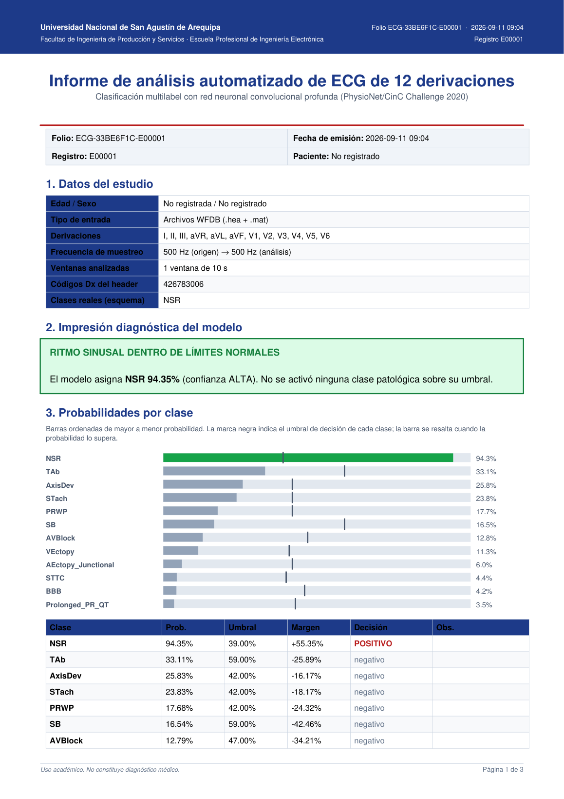

<a id="readme-top"></a>
<!--
*** Plantilla base: https://github.com/othneildrew/Best-README-Template
*** Submódulo: dashboard web Flask para análisis de ECG CINC2020-12.
-->

[![Python 3.10+][python-shield]][python-url]
[![Flask][flask-shield]][flask-url]

<br />
<div align="center">
  <a href="https://github.com/PatVela/Proyectos-Universidad">
    
  </a>

<h3 align="center">Webapp ECG CINC2020-12</h3>

  <p align="center">
    Dashboard Flask bilingüe (ES/EN) para analizar ECG de 12 derivaciones
    <br />
    con el modelo multilabel, trazado en papel milimetrado e informe PDF.
    <br />
    <a href="../README.md"><strong>Volver al README principal »</strong></a>
    <br />
    <br />
    <a href="../examples/cinc2020/README.md">Ver pipeline</a>
    &middot;
    <a href="https://github.com/PatVela/Proyectos-Universidad/issues/new?labels=bug">Reportar Bug</a>
    &middot;
    <a href="https://github.com/PatVela/Proyectos-Universidad/issues/new?labels=enhancement">Pedir Funcionalidad</a>
  </p>
</div>

<details>
  <summary>Tabla de contenidos</summary>
  <ol>
    <li>
      <a href="#sobre-este-módulo">Sobre este módulo</a>
      <ul>
        <li><a href="#funcionalidades">Funcionalidades</a></li>
      </ul>
    </li>
    <li>
      <a href="#primeros-pasos">Primeros pasos</a>
      <ul>
        <li><a href="#prerrequisitos">Prerrequisitos</a></li>
        <li><a href="#ejecución">Ejecución</a></li>
      </ul>
    </li>
    <li><a href="#uso">Uso</a></li>
    <li><a href="#estructura">Estructura</a></li>
    <li><a href="#roadmap">Roadmap</a></li>
    <li><a href="#licencia">Licencia</a></li>
    <li><a href="#contacto">Contacto</a></li>
  </ol>
</details>

## Sobre este módulo



Aplicación Flask tipo dashboard: se sube un ECG, se analiza con el mejor checkpoint disponible y se presenta el resultado con probabilidades por clase, comparación contra etiquetas reales, trazado ECG e informe PDF descargable. Incluye secciones de detalle técnico, métricas de evaluación y experimentos cuando existen archivos generados por el pipeline.

### Funcionalidades

* Carga por arrastrar/seleccionar archivo (CSV o par WFDB `.hea + .mat`).
* Conversión automática del par `.hea + .mat` a CSV preprocesado descargable.
* Selección automática del mejor checkpoint disponible en la carpeta `saved/` configurada.
* Predicción multilabel con probabilidades, márgenes y umbrales por clase.
* Detección automática de los umbrales calibrados por la evaluación; respaldo global 0.5 si no existen.
* Trazado ECG con cuadrícula tipo papel milimetrado.
* Informe PDF profesional con veredicto, gráfico de barras y trazado.
* Comparación con etiquetas reales: automática desde `Dx` (WFDB) o manual para CSV (clases o SNOMED).
* Ficha técnica del registro y del modelo, esquema SNOMED-CT y métricas exportadas.
* Secciones de comparación arquitectónica y robustez alimentadas por los experimentos.
* Interfaz bilingüe ES/EN y tema claro/oscuro persistentes.

<p align="right">(<a href="#readme-top">volver arriba</a>)</p>

## Primeros pasos

### Prerrequisitos

* Instalación base del proyecto (ver [README principal](../README.md#instalación)).
* Al menos un checkpoint entrenado (`best.pt`) dentro de `saved/`.

### Ejecución

Desde la raíz del proyecto, sin variables de entorno. La opción recomendada deja que la app elija el mejor checkpoint:

```sh
python webapp/app.py --saved saved
```

Carpeta específica, host y puerto personalizados:

```sh
python webapp/app.py \
  --saved saved/cinc2020 \
  --uploads <dir-subidas> \
  --results <dir-salidas-web> \
  --host 0.0.0.0 \
  --port 5002
```

Para una demostración reproducible puede fijar un checkpoint exacto por CLI (la interfaz web no muestra selector de modelo):

```sh
python webapp/app.py --model saved/cinc2020/cinc2020_resnet/<run>/best.pt
```

Si los umbrales calibrados están en una ruta no estándar, páselos explícitamente:

```sh
python webapp/app.py \
  --saved saved \
  --thresholds <umbrales-por-clase.csv>
```

Para demos puede dejar activo el fallback normal: si ninguna clase supera su umbral y `P(NSR) >= 0.40`, la salida final añade `NSR` como postprocesamiento explícito (no cambia probabilidades ni pesos). Para desactivarlo:

```sh
python webapp/app.py --saved saved --normal-fallback-min-prob 0
```

Opcionalmente, entrada WSGI:

```sh
python webapp/wsgi.py --saved saved
```

<p align="right">(<a href="#readme-top">volver arriba</a>)</p>

## Uso

### Formato CSV

Las 12 derivaciones estándar como columnas:

```text
I,II,III,aVR,aVL,aVF,V1,V2,V3,V4,V5,V6
```

Opcionalmente puede empezar con `# Sampling Rate: 500 Hz`; si no se indica, se asume 500 Hz. Para comparar contra etiquetas reales, use el campo opcional de la interfaz:

```text
NSR, AF
426783006,164889003
```

### Formato WFDB

Seleccione ambos archivos del mismo registro:

```text
A0001.hea
A0001.mat
```

La app valida que el stem coincida, lee el header, preprocesa la señal, compara predicción vs `Dx` y genera un CSV convertido descargable.

### Endpoints

| Método | Ruta | Descripción |
|---|---|---|
| `GET` | `/` | Dashboard (carga, resultado, detalle técnico, experimentos) |
| `POST` | `/predict` | Analiza archivos + umbral; devuelve JSON con probabilidades, trazado y PDF |
| `GET` | `/results/<archivo>` | Descarga artefactos generados (PDF, PNG, CSV convertido) |
| `GET` | `/models` | Checkpoints disponibles en la carpeta configurada |
| `GET` | `/metrics` | Métricas de evaluación en JSON (si existen) |
| `GET` | `/experiments` | Comparación y robustez en JSON (si existen) |
| `GET` | `/health` | Estado del modelo cargado |

### Cómo se llenan las secciones de métricas y experimentos

Ejecute el pipeline de evaluación y experimentos (ver [examples/cinc2020/README.md](../examples/cinc2020/README.md#uso)); la webapp detecta automáticamente los CSV generados y completa las tablas, resúmenes de mejor/peor clase, ganador arquitectónico y caídas de robustez. La evaluación también calibra los umbrales por clase que la app usa en lugar del respaldo global 0.5.

<p align="right">(<a href="#readme-top">volver arriba</a>)</p>

## Estructura

```text
webapp/
├── app.py            # Flask + rutas + carga de métricas/experimentos
├── prediction.py     # inferencia, conversión WFDB→CSV y gráficos
├── report_pdf.py     # informe PDF profesional
├── project_info.py   # datos institucionales y referencia bibliográfica
├── wsgi.py           # entrada WSGI para despliegue
├── templates/index.html
└── static/app.js     # dashboard + i18n ES/EN
```

<p align="right">(<a href="#readme-top">volver arriba</a>)</p>

## Roadmap

- [x] Detalle técnico bilingüe con ficha de registro y modelo
- [x] Métricas, comparación y robustez integradas al dashboard
- [x] Informe PDF con veredicto y gráfico de probabilidades
- [ ] Gráficas interactivas de métricas por clase
- [ ] Historial de análisis por sesión

Ver los [issues abiertos](https://github.com/PatVela/Proyectos-Universidad/issues) para más propuestas.

<p align="right">(<a href="#readme-top">volver arriba</a>)</p>

## Licencia

Distribuido bajo licencia GPL-3.0. Ver `LICENSE` en la raíz para más información.

<p align="right">(<a href="#readme-top">volver arriba</a>)</p>

## Contacto

PatVela — Universidad Nacional de San Agustín de Arequipa.

Link del proyecto: [https://github.com/PatVela/Proyectos-Universidad](https://github.com/PatVela/Proyectos-Universidad)

<p align="right">(<a href="#readme-top">volver arriba</a>)</p>

## Nota

La webapp es una herramienta académica. Las predicciones no constituyen diagnóstico médico.

[python-shield]: https://img.shields.io/badge/python-3.10%2B-blue?style=for-the-badge&logo=python
[python-url]: https://www.python.org/
[flask-shield]: https://img.shields.io/badge/flask-000000?style=for-the-badge&logo=flask&logoColor=white
[flask-url]: https://flask.palletsprojects.com/
